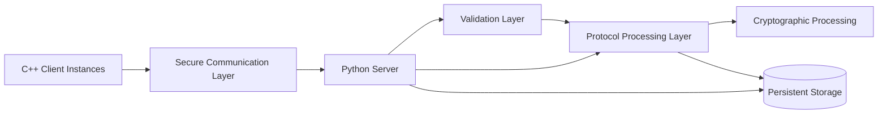
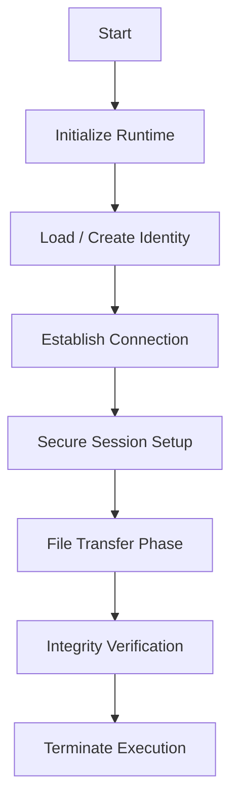
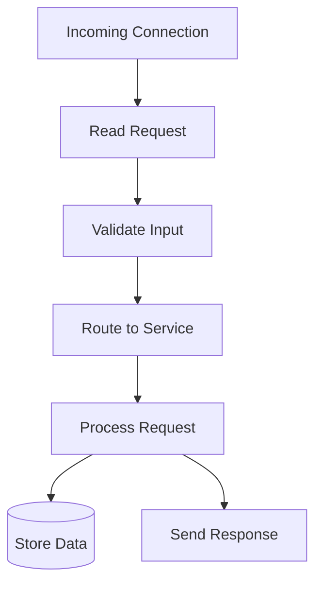
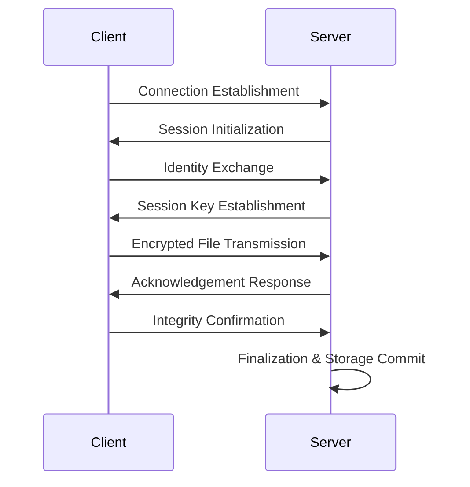
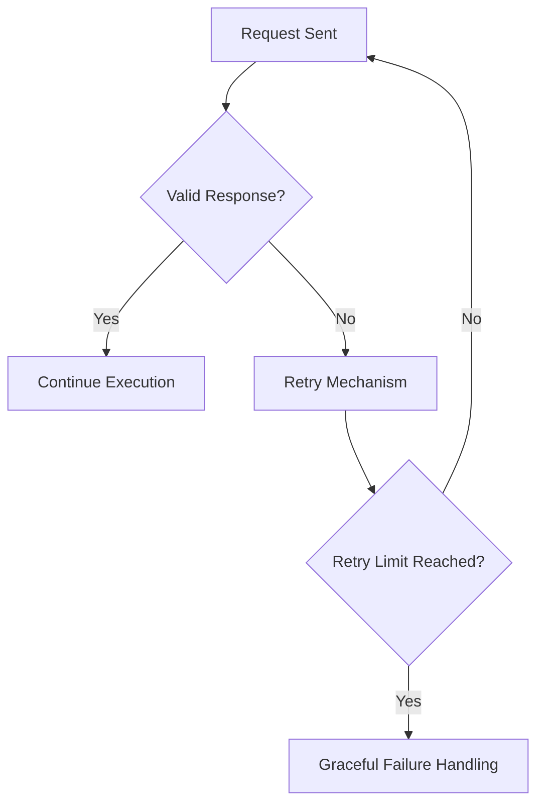
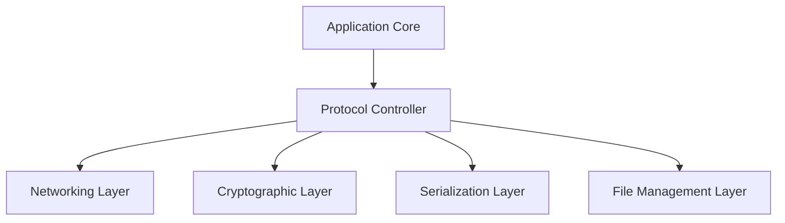
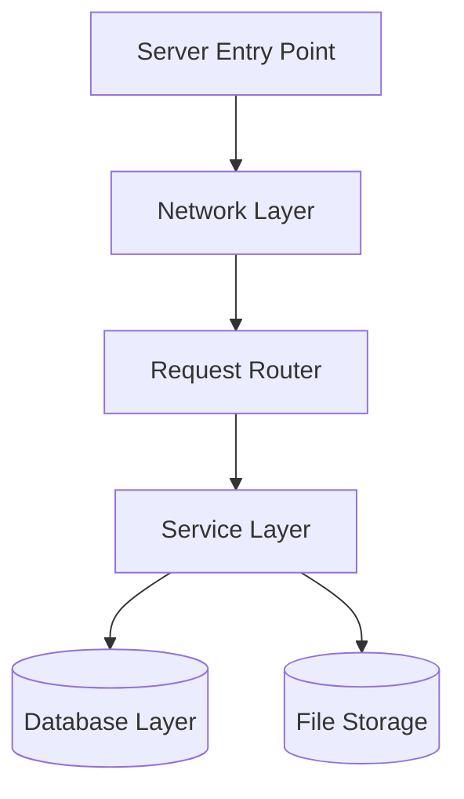

# 🛡️ Secure Client–Server File Transfer System

**Final Project | Defensive Programming Course | The Open University of Israel**

> ⚠️ **Disclaimer**
> - For educational and portfolio purposes only
> - No proprietary content from The Open University of Israel is included
> - Full source code is maintained **privately** for academic compliance

---

## 📖 Table of Contents

- [Overview](#overview)
- [End-to-End Protocol Execution](#end-to-end-protocol-execution-successful-session)
- [Technology Stack](#technology-stack)
- [High-Level System Architecture](#high-level-system-architecture)
- [Architectural Principles](#architectural-principles)
- [Secure Communication Model](#secure-communication-model)
- [Reliability & Fault Tolerance](#reliability--fault-tolerance)
- [Client Architecture](#client-architecture)
- [Server Architecture](#server-architecture)
- [Cryptographic Design](#cryptographic-design-high-level)
- [System Capabilities](#system-capabilities)
- [Engineering Challenges](#engineering-challenges)
- [Reliability Model](#reliability-model)
- [Key Learnings](#key-learnings)
- [Credits](#credits)
---

## Overview

This project implements a **secure, layered client–server system** for controlled file transfer over TCP.

The system demonstrates principles of:

- Secure distributed system design
- Layered software architecture
- Defensive programming and validation-first design
- Encrypted client–server communication
- Fault-tolerant network systems
- Multi-client concurrent processing

The system is designed to ensure **correctness, isolation, and resilience under unreliable network and runtime conditions**.

---

## End-to-End Protocol Execution (Successful Session)

This recording demonstrates a full successful execution of the system protocol from start to finish.

The system runs in real-time with both server and client terminals displayed simultaneously, showing the complete lifecycle of a secure file transfer session.

### Observed Flow

- Server starts and enters listening state
- Client process is launched (`client.exe`)
- TCP connection is established automatically
- Protocol handshake and identity phase are executed
- Cryptographic session setup is performed
- File transfer phase is completed successfully
- Integrity validation (CRC) passes
- Session terminates normally with success state

> This is a real execution trace of the system. No steps are simulated or pre-rendered.

---

## Technology Stack

### Client Side
- **C++17**
- Boost Libraries
  - Networking (TCP communication abstraction)
  - Serialization utilities
  - Binary compatibility tools
- Crypto++  
  - Cryptographic primitives (RSA / AES abstractions)
- CMake build system
- vcpkg dependency management

### Server Side
- **Python 3.11**
- Socket programming (TCP-based networking)
- `selectors` module (event-driven concurrency model)
- SQLite (persistent storage layer)
- PyCryptodome (cryptographic operations abstraction)

---

## High-Level System Architecture

---

## Architectural Principles

### 1. Layered Design
The system is structured into independent layers:

* Communication Layer
* Protocol Control Layer
* Processing / Service Layer
* Persistence Layer
* Cryptographic Layer
* 
Each layer is isolated and communicates through well-defined interfaces.

### 2. Separation of Concerns
Responsibilities are strictly separated:

* Client handles execution and local state only
* Server handles validation, processing, and storage
* Cryptography is isolated from business logic
* Networking is decoupled from protocol logic

### 3. Deterministic Execution Model (Client)
The client operates as a **state-driven deterministic pipeline**:

### 4. Event-Driven Server Model
The server is built on an **event-driven concurrency model**:

---

## 🔐 Secure Communication Model
The system implements a **structured secure handshake and encrypted session model**.

### High-Level Security Flow

---

## Reliability & Fault Tolerance
The system is designed to operate under failure conditions:

### Supported Failure Scenarios
* Network interruptions
* Partial or corrupted transmissions
* Invalid or malformed requests
* Server-side processing errors
* Integrity mismatches

---

## Client Architecture

### Responsibilities
* Managing deterministic execution flow
* Coordinating communication lifecycle
* Handling local file operations
* Managing secure session state
* Delegating cryptographic operations

---

## Server Architecture

### Responsibilities
* Handling concurrent client connections
* Request parsing and validation
* Business logic execution
* Persistent storage management
* Secure file handling pipeline

---

## Cryptographic Design (High-Level)
The system uses a **hybrid encryption model**:

* Asymmetric cryptography for secure session initialization
* Symmetric encryption for file transfer efficiency
Integrity verification mechanisms for data correctness

> Cryptographic operations are fully delegated to trusted external libraries to ensure correctness and security.

---

## System Capabilities
* Multi-client concurrent execution
* Secure session-based communication
* Encrypted file transfer pipeline
* Persistent server-side storage
* Client identity persistence across sessions
* Strict validation at all system layers
* Deterministic execution model on client side

---

## Engineering Challenges
* Designing a structured distributed system from scratch
* Handling TCP stream-based communication safely
* Managing concurrency in an event-driven server
* Ensuring deterministic execution in a stateful client
* Designing layered architecture with strict separation
* Implementing robust failure recovery strategies
* Maintaining data integrity under unreliable conditions

---

## Reliability Model
The system follows a **validation-first and fail-safe** design approach:

* Every request is validated before processing
* Invalid or corrupted data is rejected immediately
* Failures trigger controlled retry mechanisms
* System avoids undefined states by design

---

## Key Learnings

* Distributed systems architecture
* TCP-based network programming
* Client–server protocol design (conceptual)
* Secure system design principles
* Concurrency and event-driven systems
* Layered software architecture
* Defensive programming methodologies

---

## Credits

Developed as part of the **Defensive Programming Course at The Open University of Israel**.
